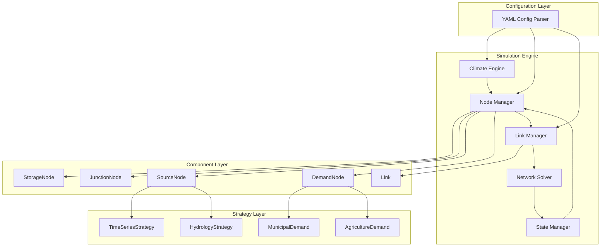

# HydroSim Framework Design Document

## Overview

HydroSim is a Python-based water resources planning framework that operates on daily timesteps to simulate complex water networks. The framework architecture is built on three core abstractions: **Nodes** (locations that interact with the environment), **Links** (connections that transport water with constraints), and a **Solver** (optimizer that allocates flows). The design emphasizes explicit topology definition, separation of concerns, and a constraint-stacking approach where components calculate their own feasible limits before network-wide optimization.

The framework supports:
- Multiple node types (Storage, Junction, Source, Demand) with pluggable strategies
- Constraint-based link modeling with physical, hydraulic, and control layers
- Minimum cost network flow optimization
- Climate-driven simulation with ET0 calculation
- YAML-based configuration for human-readable model definition

## Architecture

### High-Level Architecture



### Execution Flow

The simulation follows a strict order of operations for each timestep:

```mermaid
sequenceDiagram
    participant ENV as Climate Engine
    participant NODES as Nodes
    participant LINKS as Links
    participant SOLVER as Solver
    participant STATE as State Manager
    
    loop Each Timestep
        ENV->>ENV: Update climate drivers (P, T, Solar)
        ENV->>ENV: Calculate ET0 (Hargreaves)
        ENV->>NODES: Broadcast ET0
        
        NODES->>NODES: SourceNodes: Generate inflows
        NODES->>NODES: DemandNodes: Calculate requests
        NODES->>NODES: StorageNodes: Calculate evaporation
        
        LINKS->>NODES: Query current state (head, storage)
        LINKS->>LINKS: Calculate physical limits
        LINKS->>LINKS: Calculate hydraulic limits
        LINKS->>LINKS: Apply control logic
        LINKS->>LINKS: Compute constraint funnel (Qmin, Qmax, Cost)
        
        LINKS->>SOLVER: Provide constraints
        SOLVER->>SOLVER: Construct network flow problem
        SOLVER->>SOLVER: Minimize cost subject to constraints
        SOLVER->>STATE: Return flow allocations
        
        STATE->>NODES: Update storage volumes
        STATE->>STATE: Move mass according to flows
    end
```

## Components and Interfaces

### Core Abstractions

#### Node (Abstract Base Class)

```python
class Node(ABC):
    """Base class for all network nodes."""
    
    def __init__(self, node_id: str, node_type: str):
        self.node_id = node_id
        self.node_type = node_type
        self.inflows: List[Link] = []
        self.outflows: List[Link] = []
    
    @abstractmethod
    def step(self, climate: ClimateState) -> None:
        """Execute node-specific logic for the current timestep."""
        pass
    
    @abstractmethod
    def get_state(self) -> Dict[str, float]:
        """Return current node state for reporting."""
        pass
```

#### Link (Concrete Class)

```python
class Link:
    """Represents a connection between two nodes with constraints."""
    
    def __init__(self, link_id: str, source: Node, target: Node, 
                 physical_capacity: float, cost: float):
        self.link_id = link_id
        self.source = source
        self.target = target
        self.physical_capacity = physical_capacity
        self.cost = cost
        self.control: Optional[Control] = None
        self.hydraulic_model: Optional[HydraulicModel] = None
    
    def calculate_constraints(self) -> Tuple[float, float, float]:
        """
        Apply constraint funnel to determine feasible flow bounds.
        Returns: (q_min, q_max, cost)
        """
        q_max = self.physical_capacity
        
        # Apply hydraulic constraints
        if self.hydraulic_model:
            q_max = min(q_max, self.hydraulic_model.calculate_capacity(self.source))
        
        # Apply control constraints
        if self.control:
            q_max = min(q_max, self.control.calculate_limit(q_max, self.source, self.target))
        
        return (0.0, q_max, self.cost)
```

#### Solver Interface

```python
class NetworkSolver(ABC):
    """Abstract interface for network flow optimization."""
    
    @abstractmethod
    def solve(self, nodes: List[Node], links: List[Link], 
              constraints: Dict[str, Tuple[float, float, float]]) -> Dict[str, float]:
        """
        Solve minimum cost network flow problem.
        
        Args:
            nodes: List of all nodes in the network
            links: List of all links in the network
            constraints: Dict mapping link_id to (q_min, q_max, cost)
        
        Returns:
            Dict mapping link_id to allocated flow
        """
        pass
```

### Node Implementations

#### StorageNode

```python
class StorageNode(Node):
    """Reservoir or tank with mass storage."""
    
    def __init__(self, node_id: str, initial_storage: float, 
                 eav_table: ElevationAreaVolume):
        super().__init__(node_id, "storage")
        self.storage = initial_storage
        self.eav_table = eav_table
        self.evap_loss = 0.0
    
    def get_elevation(self) -> float:
        """Interpolate elevation from current storage."""
        return self.eav_table.storage_to_elevation(self.storage)
    
    def get_surface_area(self) -> float:
        """Interpolate surface area from current storage."""
        return self.eav_table.storage_to_area(self.storage)
    
    def step(self, climate: ClimateState) -> None:
        """Calculate evaporation loss."""
        area = self.get_surface_area()
        self.evap_loss = area * climate.et0
    
    def update_storage(self, inflow: float, outflow: float) -> None:
        """Update storage based on mass balance."""
        self.storage += inflow - outflow - self.evap_loss
```

#### JunctionNode

```python
class JunctionNode(Node):
    """Stateless connection point with no storage."""
    
    def __init__(self, node_id: str):
        super().__init__(node_id, "junction")
    
    def step(self, climate: ClimateState) -> None:
        """No state update needed for junctions."""
        pass
    
    def get_state(self) -> Dict[str, float]:
        """Junctions have no internal state."""
        return {}
```

#### SourceNode

```python
class SourceNode(Node):
    """Water source with pluggable generation strategy."""
    
    def __init__(self, node_id: str, generator: GeneratorStrategy):
        super().__init__(node_id, "source")
        self.generator = generator
        self.inflow = 0.0
    
    def step(self, climate: ClimateState) -> None:
        """Generate inflow using strategy."""
        self.inflow = self.generator.generate(climate)
    
    def get_state(self) -> Dict[str, float]:
        return {"inflow": self.inflow}
```

#### DemandNode

```python
class DemandNode(Node):
    """Water demand with pluggable demand model."""
    
    def __init__(self, node_id: str, demand_model: DemandModel):
        super().__init__(node_id, "demand")
        self.demand_model = demand_model
        self.request = 0.0
        self.delivered = 0.0
        self.deficit = 0.0
    
    def step(self, climate: ClimateState) -> None:
        """Calculate demand request."""
        self.request = self.demand_model.calculate(climate)
    
    def update_delivery(self, delivered: float) -> None:
        """Update delivered amount and calculate deficit."""
        self.delivered = delivered
        self.deficit = max(0.0, self.request - delivered)
    
    def get_state(self) -> Dict[str, float]:
        return {
            "request": self.request,
            "delivered": self.delivered,
            "deficit": self.deficit
        }
```

### Strategy Implementations

#### Generator Strategies

```python
class GeneratorStrategy(ABC):
    """Abstract base for inflow generation strategies."""
    
    @abstractmethod
    def generate(self, climate: ClimateState) -> float:
        """Generate inflow volume for current timestep."""
        pass

class TimeSeriesStrategy(GeneratorStrategy):
    """Read inflows from time series data."""
    
    def __init__(self, data: pd.DataFrame, column: str):
        self.data = data
        self.column = column
        self.current_index = 0
    
    def generate(self, climate: ClimateState) -> float:
        value = self.data.iloc[self.current_index][self.column]
        self.current_index += 1
        return value

class HydrologyStrategy(GeneratorStrategy):
    """Simulate runoff using Snow17 and AWBM models."""
    
    def __init__(self, snow17_params: dict, awbm_params: dict, area: float):
        self.snow17 = Snow17Model(**snow17_params)
        self.awbm = AWBMModel(**awbm_params)
        self.area = area
    
    def generate(self, climate: ClimateState) -> float:
        # Snow17: Partition precip into rain and snow, track snowpack
        rain, snow_melt = self.snow17.step(
            climate.precip, climate.t_max, climate.t_min
        )
        
        # AWBM: Convert effective precip to runoff
        runoff_depth = self.awbm.step(rain + snow_melt, climate.et0)
        
        # Convert depth to volume
        return runoff_depth * self.area
```

#### Demand Models

```python
class DemandModel(ABC):
    """Abstract base for demand calculation strategies."""
    
    @abstractmethod
    def calculate(self, climate: ClimateState) -> float:
        """Calculate demand for current timestep."""
        pass

class MunicipalDemand(DemandModel):
    """Population-based municipal demand."""
    
    def __init__(self, population: float, per_capita_demand: float):
        self.population = population
        self.per_capita_demand = per_capita_demand
    
    def calculate(self, climate: ClimateState) -> float:
        return self.population * self.per_capita_demand

class AgricultureDemand(DemandModel):
    """Crop coefficient-based agricultural demand."""
    
    def __init__(self, area: float, crop_coefficient: float):
        self.area = area
        self.kc = crop_coefficient
    
    def calculate(self, climate: ClimateState) -> float:
        # ET_crop = Kc * ET0
        et_crop = self.kc * climate.et0
        return et_crop * self.area
```

### Control Systems

```python
class Control(ABC):
    """Abstract base for link control logic."""
    
    @abstractmethod
    def calculate_limit(self, base_capacity: float, source: Node, 
                       target: Node) -> float:
        """Calculate controlled flow limit."""
        pass

class FractionalControl(Control):
    """Throttle capacity by a fraction (0.0 to 1.0)."""
    
    def __init__(self, fraction: float):
        self.fraction = max(0.0, min(1.0, fraction))
    
    def calculate_limit(self, base_capacity: float, source: Node, 
                       target: Node) -> float:
        return base_capacity * self.fraction

class AbsoluteControl(Control):
    """Set a hard flow cap in absolute units."""
    
    def __init__(self, max_flow: float):
        self.max_flow = max_flow
    
    def calculate_limit(self, base_capacity: float, source: Node, 
                       target: Node) -> float:
        return min(base_capacity, self.max_flow)

class SwitchControl(Control):
    """Binary on/off control."""
    
    def __init__(self, is_on: bool):
        self.is_on = is_on
    
    def calculate_limit(self, base_capacity: float, source: Node, 
                       target: Node) -> float:
        return base_capacity if self.is_on else 0.0
```

### Hydraulic Models

```python
class HydraulicModel(ABC):
    """Abstract base for hydraulic capacity calculations."""
    
    @abstractmethod
    def calculate_capacity(self, source_node: Node) -> float:
        """Calculate hydraulic capacity based on source state."""
        pass

class WeirModel(HydraulicModel):
    """Weir flow equation: Q = C * L * H^(3/2)"""
    
    def __init__(self, coefficient: float, length: float, crest_elevation: float):
        self.C = coefficient
        self.L = length
        self.crest_elev = crest_elevation
    
    def calculate_capacity(self, source_node: Node) -> float:
        if not isinstance(source_node, StorageNode):
            return float('inf')
        
        head = max(0.0, source_node.get_elevation() - self.crest_elev)
        return self.C * self.L * (head ** 1.5)

class PipeModel(HydraulicModel):
    """Pipe flow with fixed capacity."""
    
    def __init__(self, capacity: float):
        self.capacity = capacity
    
    def calculate_capacity(self, source_node: Node) -> float:
        return self.capacity
```

## Data Models

### Climate State

```python
@dataclass
class ClimateState:
    """Climate drivers for a single timestep."""
    date: datetime
    precip: float  # mm
    t_max: float   # °C
    t_min: float   # °C
    solar: float   # MJ/m²/day
    et0: float     # mm (calculated)
```

### Site Configuration

```python
@dataclass
class SiteConfig:
    """Site-specific parameters for climate calculations."""
    latitude: float   # degrees
    elevation: float  # meters
```

### Elevation-Area-Volume Table

```python
class ElevationAreaVolume:
    """Interpolation table for storage properties."""
    
    def __init__(self, elevations: List[float], areas: List[float], 
                 volumes: List[float]):
        self.elevations = np.array(elevations)
        self.areas = np.array(areas)
        self.volumes = np.array(volumes)
    
    def storage_to_elevation(self, storage: float) -> float:
        """Interpolate elevation from storage volume."""
        return np.interp(storage, self.volumes, self.elevations)
    
    def storage_to_area(self, storage: float) -> float:
        """Interpolate surface area from storage volume."""
        return np.interp(storage, self.volumes, self.areas)
```

### Network Graph

```python
class NetworkGraph:
    """Directed graph representation of the water network."""
    
    def __init__(self):
        self.nodes: Dict[str, Node] = {}
        self.links: Dict[str, Link] = {}
    
    def add_node(self, node: Node) -> None:
        """Add a node to the network."""
        self.nodes[node.node_id] = node
    
    def add_link(self, link: Link) -> None:
        """Add a link to the network and update node connections."""
        self.links[link.link_id] = link
        link.source.outflows.append(link)
        link.target.inflows.append(link)
    
    def validate(self) -> List[str]:
        """
        Validate network topology.
        Returns list of error messages (empty if valid).
        """
        errors = []
        
        # Check all links reference existing nodes
        for link_id, link in self.links.items():
            if link.source.node_id not in self.nodes:
                errors.append(f"Link {link_id} references non-existent source {link.source.node_id}")
            if link.target.node_id not in self.nodes:
                errors.append(f"Link {link_id} references non-existent target {link.target.node_id}")
        
        # Check for orphaned nodes (optional warning)
        for node_id, node in self.nodes.items():
            if len(node.inflows) == 0 and len(node.outflows) == 0:
                if node.node_type not in ["source", "demand"]:
                    errors.append(f"Node {node_id} has no connections")
        
        return errors
```

## Correctness Properties


*A property is a characteristic or behavior that should hold true across all valid executions of a system—essentially, a formal statement about what the system should do. Properties serve as the bridge between human-readable specifications and machine-verifiable correctness guarantees.*

### Property 1: Network topology validation

*For any* network configuration, all Link source and target references must point to nodes that exist in the network definition.
**Validates: Requirements 1.3, 16.1, 16.2**

### Property 2: Explicit flow paths

*For any* water transfer between nodes, an explicit Link object must exist connecting those nodes, and the sum of all link flows must equal total mass movement in the system.
**Validates: Requirements 1.2, 11.1, 11.3**

### Property 3: Climate data completeness

*For any* simulation timestep, the Climate Engine must provide all required climate drivers (precipitation, T_max, T_min, solar radiation) and calculated ET0.
**Validates: Requirements 3.1, 3.5**

### Property 4: ET0 calculation correctness

*For any* set of climate inputs (T_max, T_min, solar radiation, latitude), the calculated ET0 must match the Hargreaves method formula.
**Validates: Requirements 3.2**

### Property 5: Storage tracking invariant

*For any* StorageNode over any timestep, the change in storage must equal inflow minus outflow minus evaporation losses.
**Validates: Requirements 4.1**

### Property 6: Evaporation calculation correctness

*For any* StorageNode with an EAV table and ET0 value, evaporation must equal the interpolated surface area times ET0.
**Validates: Requirements 4.2, 12.5**

### Property 7: Junction mass balance

*For any* JunctionNode at any timestep, total inflow must equal total outflow with no mass storage.
**Validates: Requirements 4.3**

### Property 8: Strategy pattern pluggability

*For any* SourceNode or DemandNode, switching between different strategy implementations must not modify other node properties and must produce strategy-specific results.
**Validates: Requirements 4.4, 4.5, 5.4, 6.5**

### Property 9: Generator availability

*For any* SourceNode after the node step, the generated inflow volume must be available and accessible for the solver allocation step.
**Validates: Requirements 5.5**

### Property 10: Demand deficit tracking

*For any* DemandNode where delivered water is less than requested water, the deficit must equal the difference between request and delivery.
**Validates: Requirements 6.4**

### Property 11: Constraint funnel minimum

*For any* Link with multiple constraint layers (physical, hydraulic, control), the final maximum flow limit must equal the minimum of all applicable constraint values.
**Validates: Requirements 7.4**

### Property 12: Constraint output completeness

*For any* Link providing constraints to the solver, the output must include minimum flow, maximum flow, and cost parameters.
**Validates: Requirements 7.5**

### Property 13: Solver mass balance conservation

*For any* network and any solver solution, mass balance must be conserved at all nodes (inflow = outflow + change in storage).
**Validates: Requirements 9.3**

### Property 14: Solver constraint satisfaction

*For any* solver solution, all allocated link flows must be within the minimum and maximum bounds provided by each Link.
**Validates: Requirements 9.4**

### Property 15: Solver solution completeness

*For any* network, the solver solution must include flow values for all links in the network.
**Validates: Requirements 9.5**

### Property 16: Solver cost minimization

*For any* network with multiple feasible solutions, the solver must select the solution that minimizes the sum of (flow × cost) across all links.
**Validates: Requirements 9.2**

### Property 17: Timestep execution order

*For any* simulation timestep, the execution order must be: (1) environment step, (2) node step, (3) link step, (4) solver step, (5) state update.
**Validates: Requirements 10.1, 10.2, 10.3, 10.4, 10.5**

### Property 18: EAV interpolation correctness

*For any* StorageNode with an EAV table and storage volume, the interpolated elevation and surface area must be consistent with the table values.
**Validates: Requirements 12.2, 12.3**

### Property 19: Head query consistency

*For any* Link querying a StorageNode for head, the returned value must equal the current elevation of the storage node.
**Validates: Requirements 12.4, 13.3**

### Property 20: Hydraulic limit recalculation

*For any* Link with hydraulic models, when upstream conditions change, the flow limits must be recalculated before the next solver execution.
**Validates: Requirements 13.4**

### Property 21: Daily timestep increment

*For any* simulation time advancement, the time must increment by exactly one day.
**Validates: Requirements 14.1**

### Property 22: Daily output resolution

*For any* simulation results, all output values must be reported at daily intervals.
**Validates: Requirements 14.5**

### Property 23: YAML parsing completeness

*For any* valid YAML configuration, parsing must extract all node definitions (type and parameters), link definitions (source, target, constraints, costs), and climate configuration (data sources and site parameters).
**Validates: Requirements 15.1, 15.2, 15.3, 15.5**

### Property 24: Topology validation completeness

*For any* network configuration, validation must verify that all link references point to existing nodes and identify any orphaned nodes.
**Validates: Requirements 16.3, 16.4, 16.5**

### Property 25: Output completeness

*For any* completed simulation, the output must include flow values for all links, storage volumes for all StorageNodes, deficits for all DemandNodes, and inflows for all SourceNodes at each timestep.
**Validates: Requirements 17.1, 17.2, 17.3, 17.4**

### Property 26: Stepwise optimization without lookahead

*For any* timestep, the solver must optimize using only current day constraints and must not access future climate data or future system states.
**Validates: Requirements 18.1, 18.2**

### Property 27: Sequential timestep solving

*For any* multi-timestep simulation, timesteps must be solved independently in sequence, with state updates occurring between timesteps.
**Validates: Requirements 18.3, 18.4**

### Property 28: Constraint update propagation

*For any* simulation where constraints change between timesteps, the updated constraints must be used in the next optimization.
**Validates: Requirements 18.5**

## Error Handling

### Configuration Errors

**Invalid YAML Syntax:**
- Catch parsing exceptions and report line number and error type
- Provide helpful error messages indicating what was expected

**Missing Node References:**
- Validate all link source/target references during network construction
- Report all missing references with link IDs and referenced node IDs

**Malformed Links:**
- Detect links without both source and target nodes
- Reject configuration and list all malformed links

**Invalid Timestep Configuration:**
- Detect and reject sub-daily timestep configurations
- Provide error message explaining daily timestep requirement

### Runtime Errors

**Negative Storage:**
- Detect when storage would go negative due to excessive outflow or evaporation
- Options: (1) Constrain outflow to available storage, (2) Raise error and halt simulation
- Log warning when storage approaches minimum

**Infeasible Network Flow:**
- Detect when solver cannot find feasible solution (e.g., demand exceeds supply with no valid flow paths)
- Report which constraints are conflicting
- Option to continue with partial solution or halt

**Missing Climate Data:**
- Detect when time series data is exhausted before simulation end
- Raise error with clear message about data availability vs. simulation period

**EAV Table Interpolation Out of Bounds:**
- Detect when storage volume is outside EAV table range
- Options: (1) Extrapolate using boundary slopes, (2) Clamp to table bounds, (3) Raise error
- Log warning when approaching table boundaries

### Validation Errors

**Orphaned Nodes:**
- Detect nodes with no inflows or outflows (except sources and demands)
- Report as warnings rather than errors (may be intentional)

**Disconnected Subgraphs:**
- Detect when network contains multiple disconnected components
- Report all disconnected subgraphs
- Allow simulation to proceed if intentional

**Invalid Control Parameters:**
- Validate fractional control values are in [0.0, 1.0]
- Validate absolute control values are non-negative
- Raise configuration error for invalid values

## Testing Strategy

### Unit Testing

The framework will use **pytest** as the primary testing framework for unit tests.

**Core Component Tests:**
- Test each node type (Storage, Junction, Source, Demand) in isolation
- Test link constraint calculation with mocked node states
- Test climate engine ET0 calculation with known inputs
- Test EAV table interpolation with sample data
- Test each strategy implementation (TimeSeriesStrategy, HydrologyStrategy, MunicipalDemand, AgricultureDemand)
- Test each control type (Fractional, Absolute, Switch)
- Test each hydraulic model (Weir, Pipe)

**Configuration Tests:**
- Test YAML parsing with valid configurations
- Test error handling with invalid YAML syntax
- Test network construction from parsed configuration
- Test topology validation with various network structures

**Integration Tests:**
- Test complete simulation with small example networks
- Test multi-timestep simulation with state updates
- Test solver integration with various network topologies
- Test end-to-end flow from YAML to results output

### Property-Based Testing

The framework will use **Hypothesis** for property-based testing in Python.

**Configuration:**
- Each property-based test will run a minimum of 100 iterations
- Tests will use custom generators for domain-specific types (nodes, links, climate data)
- Each test will be tagged with a comment referencing the design document property

**Test Tagging Format:**
```python
# Feature: hydrosim-framework, Property 1: Network topology validation
def test_property_network_topology_validation():
    ...
```

**Property Test Implementation:**
- Each correctness property from the design document will be implemented as a single property-based test
- Tests will generate random valid inputs within the domain constraints
- Tests will verify the property holds across all generated inputs

**Smart Generators:**
- **NetworkGenerator**: Creates valid network topologies with random nodes and links
- **ClimateGenerator**: Creates realistic climate data within physical bounds
- **EAVTableGenerator**: Creates monotonic elevation-area-volume tables
- **ConfigGenerator**: Creates valid YAML configurations

**Example Property Test:**
```python
from hypothesis import given, strategies as st

# Feature: hydrosim-framework, Property 13: Solver mass balance conservation
@given(network=network_generator())
def test_solver_mass_balance(network):
    """For any network and solver solution, mass balance must be conserved at all nodes."""
    # Run one timestep
    network.step()
    
    # Check mass balance at each node
    for node in network.nodes.values():
        inflow = sum(link.flow for link in node.inflows)
        outflow = sum(link.flow for link in node.outflows)
        
        if isinstance(node, StorageNode):
            # Storage: inflow = outflow + delta_storage + evaporation
            delta_storage = node.storage - node.initial_storage
            assert abs(inflow - outflow - delta_storage - node.evap_loss) < 1e-6
        elif isinstance(node, JunctionNode):
            # Junction: inflow = outflow
            assert abs(inflow - outflow) < 1e-6
        elif isinstance(node, SourceNode):
            # Source: outflow = generated inflow
            assert abs(outflow - node.inflow) < 1e-6
        elif isinstance(node, DemandNode):
            # Demand: inflow = delivered
            assert abs(inflow - node.delivered) < 1e-6
```

### Test Coverage Goals

- **Unit Test Coverage**: Aim for >90% code coverage of core components
- **Property Test Coverage**: All 28 correctness properties must have corresponding property-based tests
- **Integration Test Coverage**: All major workflows (configuration → simulation → output) must be tested
- **Edge Case Coverage**: All edge cases identified in prework must be tested

### Testing Workflow

1. **Development**: Write unit tests alongside implementation
2. **Property Tests**: Implement property-based tests after core functionality is complete
3. **Integration Tests**: Add integration tests once multiple components are integrated
4. **Continuous Testing**: Run all tests on every commit
5. **Coverage Monitoring**: Track coverage metrics and identify gaps

## Implementation Notes

### Solver Implementation

The framework will use **NetworkX** for graph representation and **SciPy's linprog** or **Google OR-Tools** for minimum cost network flow optimization. The solver will:

1. Construct a directed graph from nodes and links
2. Set up the linear programming problem with:
   - Decision variables: flow on each link
   - Objective: minimize Σ(flow × cost)
   - Constraints: mass balance at each node, flow bounds on each link
3. Solve using simplex or network simplex algorithm
4. Extract flow values from solution

### Climate Engine Implementation

**Hargreaves ET0 Formula:**
```
ET0 = 0.0023 × (T_mean + 17.8) × (T_max - T_min)^0.5 × R_a
```
Where:
- T_mean = (T_max + T_min) / 2
- R_a = extraterrestrial radiation (calculated from latitude and day of year)

**WGEN Stochastic Generation:**
- Use Markov chain for wet/dry day sequences
- Use gamma distribution for precipitation amounts
- Use autoregressive model for temperature
- Preserve monthly statistics and correlations

### Hydrology Models

**Snow17:**
- Tracks snowpack accumulation and melt
- Temperature-based melt equation
- Rain-snow partitioning based on temperature threshold

**AWBM (Australian Water Balance Model):**
- Three parallel surface stores with different capacities
- Baseflow store for groundwater
- Calculates runoff as excess when stores are full

### Performance Considerations

- **Sparse Matrix Representation**: Use sparse matrices for large networks
- **Incremental Updates**: Only recalculate changed constraints
- **Vectorization**: Use NumPy for bulk calculations
- **Caching**: Cache interpolated EAV values when storage doesn't change significantly

### Extensibility Points

- **New Node Types**: Inherit from Node base class
- **New Generator Strategies**: Implement GeneratorStrategy interface
- **New Demand Models**: Implement DemandModel interface
- **New Control Types**: Inherit from Control base class
- **New Hydraulic Models**: Inherit from HydraulicModel base class
- **New Solvers**: Implement NetworkSolver interface

### Dependencies

**Core:**
- Python 3.9+
- NumPy (numerical operations)
- Pandas (time series data)
- NetworkX (graph representation)
- SciPy or OR-Tools (optimization)
- PyYAML (configuration parsing)

**Testing:**
- pytest (unit testing)
- Hypothesis (property-based testing)
- pytest-cov (coverage reporting)

**Optional:**
- Matplotlib (visualization)
- Graphviz (network diagrams)
