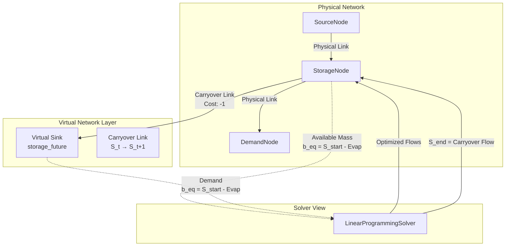

# Storage Drawdown Design Document

## Overview

This design implements active storage drawdown in HydroSim by introducing a virtual link architecture that treats final storage as a linear decision variable in the network flow optimization. The current implementation treats storage nodes as passive buffers where outflow equals inflow minus evaporation. This enhancement enables storage nodes to actively release water to meet downstream demands, allowing realistic reservoir operations.

The key innovation is the **Carryover Link** pattern: for each StorageNode, we create a virtual link representing water staying in the reservoir from timestep t to t+1. This transforms storage from a passive constraint into an active decision variable that the solver can optimize alongside physical flows.

The design maintains the existing min-cost network flow formulation without modifying the core solver algorithm. Instead, we augment the network graph with virtual nodes and links that represent storage state transitions.

## Architecture

### High-Level Architecture



### Mathematical Formulation

**Current (Passive) Formulation:**
```
Node Constraint: Inflow - Outflow = -Evap
Result: Outflow = Inflow + Evap (pass-through)
```

**New (Active) Formulation:**
```
Node Constraint: (Inflow + S_start - Evap) - (Outflow + Q_carryover) = 0

Where:
- S_start: Initial storage (source term, b_eq)
- Evap: Evaporation loss (included in source term)
- Q_carryover: Flow on carryover link (decision variable)
- S_end = Q_carryover (final storage)

Constraints on Q_carryover:
- Lower bound: DeadPool
- Upper bound: MaxStorage
- Cost: -1 (low reward, prioritize demand first)
```

### Cost Hierarchy

The solver uses cost values to prioritize water allocation:

```
COST_DEMAND = -1000   (High reward: meet demands first)
COST_STORAGE = -1     (Low reward: store water if demand is met)
COST_SPILL = 0        (No reward: spill only if necessary)
```

**Resulting Behavior:**
1. Solver maximizes negative cost (minimizes positive cost)
2. Meeting demand (-1000) is prioritized over storing water (-1)
3. Storing water (-1) is prioritized over spilling (0)
4. If demand cannot be met, solver will draw from storage (reduce Q_carryover)
5. If demand is met and storage is full, solver will spill

## Components and Interfaces

### StorageNode Enhancement

```python
class StorageNode(Node):
    """Enhanced storage node with drawdown support."""
    
    def __init__(self, node_id: str, initial_storage: float, 
                 eav_table: ElevationAreaVolume,
                 max_storage: float, min_storage: float = 0.0):
        super().__init__(node_id, "storage")
        self.storage = initial_storage
        self.eav_table = eav_table
        self.evap_loss = 0.0
        self.max_storage = max_storage
        self.min_storage = min_storage  # Dead pool
    
    def get_available_mass(self) -> float:
        """
        Calculate available mass for solver allocation.
        
        This represents water already in the reservoir that can be
        allocated either to downstream flows or to carryover storage.
        
        Returns:
            Available mass (storage - evaporation), clamped to non-negative
        """
        available = self.storage - self.evap_loss
        
        # Critical edge case: evaporation exceeds storage
        if available < 0:
            # Clamp to zero and reduce evaporation to match storage
            logger.warning(
                f"Storage node '{self.node_id}': Evaporation ({self.evap_loss:.2f}) "
                f"exceeds storage ({self.storage:.2f}). Clamping to zero."
            )
            self.evap_loss = self.storage
            available = 0.0
        
        return available
    
    def update_storage_from_carryover(self, carryover_flow: float) -> None:
        """
        Update storage based on carryover link flow.
        
        Args:
            carryover_flow: Flow on the carryover link (= final storage)
        """
        self.storage = carryover_flow
```

### Virtual Network Components

```python
@dataclass
class VirtualSink:
    """
    Represents the future state of a storage node.
    
    This is a temporary node used only during solver construction.
    It receives flow from the carryover link.
    """
    node_id: str  # Format: "{storage_node_id}_future"
    demand: float  # Equal to available mass from storage node
    
    def __post_init__(self):
        self.node_type = "virtual_sink"
        self.inflows: List[Link] = []
        self.outflows: List[Link] = []


@dataclass
class CarryoverLink:
    """
    Represents water staying in storage from t to t+1.
    
    This is a virtual link used only during solver construction.
    Flow on this link equals final storage level.
    """
    link_id: str  # Format: "{storage_node_id}_carryover"
    source: StorageNode
    target: VirtualSink
    min_flow: float  # Dead pool
    max_flow: float  # Max storage
    cost: float  # COST_STORAGE = -1
```

### Solver Enhancement

```python
class LinearProgrammingSolver(NetworkSolver):
    """Enhanced solver with virtual link support."""
    
    def solve(self, nodes: List[Node], links: List[Link], 
              constraints: Dict[str, Tuple[float, float, float]]) -> Dict[str, float]:
        """
        Solve minimum cost network flow with virtual links for storage.
        
        Process:
        1. Identify all StorageNodes
        2. For each StorageNode:
           a. Create VirtualSink node
           b. Create CarryoverLink
           c. Set boundary conditions (b_eq)
        3. Construct and solve LP as before
        4. Extract carryover flows and update storage
        """
        # Augment network with virtual components
        augmented_nodes, augmented_links, augmented_constraints = \
            self._create_virtual_network(nodes, links, constraints)
        
        # Solve using standard LP formulation
        flow_allocations = self._solve_lp(
            augmented_nodes, augmented_links, augmented_constraints
        )
        
        # Extract physical flows (exclude virtual links)
        physical_flows = {
            link_id: flow 
            for link_id, flow in flow_allocations.items()
            if not link_id.endswith("_carryover")
        }
        
        # Update storage nodes with carryover flows
        self._update_storage_from_carryover(nodes, flow_allocations)
        
        return physical_flows
    
    def _create_virtual_network(self, nodes: List[Node], links: List[Link],
                                constraints: Dict[str, Tuple[float, float, float]]) \
                                -> Tuple[List[Node], List[Link], Dict]:
        """
        Create virtual nodes and links for storage drawdown.
        
        For each StorageNode:
        1. Create virtual sink: {node_id}_future
        2. Create carryover link: {node_id}_carryover
        3. Set boundary conditions:
           - Real node: b_eq = available_mass (source)
           - Virtual sink: b_eq = available_mass (demand)
        
        Returns:
            Tuple of (augmented_nodes, augmented_links, augmented_constraints)
        """
        augmented_nodes = list(nodes)
        augmented_links = list(links)
        augmented_constraints = dict(constraints)
        
        for node in nodes:
            if node.node_type == "storage":
                # Get available mass
                available_mass = node.get_available_mass()
                
                # Create virtual sink
                virtual_sink = VirtualSink(
                    node_id=f"{node.node_id}_future",
                    demand=available_mass
                )
                augmented_nodes.append(virtual_sink)
                
                # Create carryover link
                carryover_link = CarryoverLink(
                    link_id=f"{node.node_id}_carryover",
                    source=node,
                    target=virtual_sink,
                    min_flow=node.min_storage,
                    max_flow=node.max_storage,
                    cost=COST_STORAGE
                )
                augmented_links.append(carryover_link)
                
                # Add to constraints
                augmented_constraints[carryover_link.link_id] = (
                    carryover_link.min_flow,
                    carryover_link.max_flow,
                    carryover_link.cost
                )
                
                # Update node connections
                node.outflows.append(carryover_link)
                virtual_sink.inflows.append(carryover_link)
        
        return augmented_nodes, augmented_links, augmented_constraints
    
    def _solve_lp(self, nodes: List[Node], links: List[Link],
                  constraints: Dict[str, Tuple[float, float, float]]) -> Dict[str, float]:
        """
        Solve the LP problem (existing implementation).
        
        Modified to handle:
        - StorageNode: b_eq = available_mass (source term)
        - VirtualSink: b_eq = demand (sink term)
        """
        import numpy as np
        from scipy.optimize import linprog
        
        # ... existing LP construction code ...
        
        # Modified boundary condition calculation:
        for node in nodes:
            node_idx = node_indices[node.node_id]
            
            if node.node_type == "source":
                b_eq[node_idx] = -node.inflow
            elif node.node_type == "demand":
                b_eq[node_idx] = node.request
            elif node.node_type == "storage":
                # NEW: Storage provides available mass as source
                b_eq[node_idx] = -node.get_available_mass()
            elif node.node_type == "virtual_sink":
                # NEW: Virtual sink demands available mass
                b_eq[node_idx] = node.demand
            elif node.node_type == "junction":
                b_eq[node_idx] = 0.0
        
        # ... rest of LP solution ...
    
    def _update_storage_from_carryover(self, nodes: List[Node],
                                       flow_allocations: Dict[str, float]) -> None:
        """
        Update storage nodes based on carryover link flows.
        
        Args:
            nodes: Original node list
            flow_allocations: All flow allocations including carryover links
        """
        for node in nodes:
            if node.node_type == "storage":
                carryover_link_id = f"{node.node_id}_carryover"
                if carryover_link_id in flow_allocations:
                    carryover_flow = flow_allocations[carryover_link_id]
                    node.update_storage_from_carryover(carryover_flow)
```

## Data Models

### Cost Constants

```python
# hydrosim/config.py or hydrosim/solver.py

# Cost hierarchy for solver prioritization
COST_DEMAND = -1000.0   # High reward: meet demands first
COST_STORAGE = -1.0     # Low reward: store water if demand is met
COST_SPILL = 0.0        # No reward: spill only if necessary

# Usage:
# - Demand links: cost = COST_DEMAND
# - Carryover links: cost = COST_STORAGE
# - Spillway links: cost = COST_SPILL
```

### Storage Node Configuration

```python
@dataclass
class StorageNodeConfig:
    """Configuration for storage node with drawdown support."""
    node_id: str
    initial_storage: float
    max_storage: float
    min_storage: float = 0.0  # Dead pool
    eav_table: ElevationAreaVolume
    allow_negative: bool = False
```

## Correctness Properties

*A property is a characteristic or behavior that should hold true across all valid executions of a system—essentially, a formal statement about what the system should do. Properties serve as the bridge between human-readable specifications and machine-verifiable correctness guarantees.*


### Property 1: Storage drawdown enables outflow

*For any* StorageNode with available storage above dead pool and downstream demand, the solver should allocate water from storage to meet demand, resulting in carryover flow less than initial available mass.
**Validates: Requirements 1.1, 1.2**

### Property 2: Storage refill from excess inflow

*For any* StorageNode receiving inflow exceeding downstream demand, the solver should allocate excess water to storage (carryover link), resulting in carryover flow greater than initial storage.
**Validates: Requirements 1.3**

### Property 3: Dead pool constraint enforcement

*For any* StorageNode at or below dead pool level, the carryover link flow should equal the dead pool value, preventing further drawdown.
**Validates: Requirements 1.5**

### Property 4: Carryover link creation

*For any* network with StorageNodes, the solver should create exactly one carryover link for each StorageNode with correct bounds (min = dead pool, max = max storage) and cost (COST_STORAGE).
**Validates: Requirements 2.1, 5.1, 5.2**

### Property 5: Virtual sink creation

*For any* network with StorageNodes, the solver should create exactly one virtual sink for each StorageNode with demand equal to available mass.
**Validates: Requirements 2.2**

### Property 6: Carryover flow equals final storage

*For any* StorageNode after solver execution, the final storage value should equal the flow allocated to its carryover link.
**Validates: Requirements 2.3, 2.4**

### Property 7: Independent storage handling

*For any* network with multiple StorageNodes, each node should have independent carryover links and virtual sinks, and changes to one storage node should not affect the virtual components of another.
**Validates: Requirements 2.5**

### Property 8: Available mass calculation

*For any* StorageNode, the available mass should equal max(0, storage - evaporation), ensuring non-negative values.
**Validates: Requirements 3.1, 3.5**

### Property 9: Evaporation clamping

*For any* StorageNode where evaporation exceeds storage, the available mass should be clamped to zero and evaporation should be reduced to match storage.
**Validates: Requirements 3.2**

### Property 10: Boundary condition construction

*For any* StorageNode, the solver should set b_eq = -available_mass for the storage node (source term) and b_eq = available_mass for the virtual sink (demand term).
**Validates: Requirements 3.3, 3.4**

### Property 11: Demand prioritization over storage

*For any* network where total available water is insufficient to meet both demand and maintain storage, the solver should allocate water to demand links (cost -1000) before carryover links (cost -1).
**Validates: Requirements 4.4**

### Property 12: Storage prioritization over spilling

*For any* network where water exceeds demand requirements, the solver should allocate excess water to carryover links (cost -1) before spillway links (cost 0).
**Validates: Requirements 4.5**

### Property 13: Carryover flow bounds satisfaction

*For any* carryover link, the allocated flow should be within the bounds [dead_pool, max_storage].
**Validates: Requirements 5.3, 5.4, 5.5**

### Property 14: Mass balance with virtual links

*For any* node (including virtual sinks) in the augmented network, the sum of inflows minus sum of outflows should equal the boundary condition (b_eq).
**Validates: Requirements 6.1**

### Property 15: Uniform link treatment

*For any* carryover link, it should be included in the LP matrices (A_eq, bounds, costs) identically to physical links.
**Validates: Requirements 6.2, 6.3**

### Property 16: Virtual components in mass balance

*For any* virtual sink node, it should appear in the A_eq matrix with appropriate mass balance constraints.
**Validates: Requirements 6.4**

### Property 17: Topology validation exclusion

*For any* network with virtual nodes and links, topology validation should pass without requiring virtual components to satisfy physical connectivity rules.
**Validates: Requirements 6.5**

### Property 18: Cost constant usage

*For any* link created in the system, if it is a demand link, carryover link, or spillway link, it should use the centrally defined cost constants (COST_DEMAND, COST_STORAGE, COST_SPILL) rather than hardcoded values.
**Validates: Requirements 8.4**

## Error Handling

### Negative Storage Prevention

**Evaporation Exceeds Storage:**
- Detect when evaporation would exceed current storage in `get_available_mass()`
- Clamp available mass to zero
- Reduce evaporation to match storage
- Log warning with node ID and values
- Prevent LP from receiving negative source terms

**Storage Below Dead Pool:**
- Enforce dead pool as lower bound on carryover link
- Solver will automatically respect this constraint
- If solver attempts to violate (shouldn't happen), raise error

### Infeasible Network Detection

**Insufficient Water for Demand:**
- Existing solver diagnostics will detect demand > supply
- With storage drawdown, storage acts as additional supply
- If demand still exceeds (supply + available storage), solver will report infeasibility
- Diagnostic should indicate which demands cannot be met

**Capacity Violations:**
- Carryover link upper bound enforces max storage
- If inflow + initial storage > max storage, excess must spill
- If no spillway link exists, solver may report infeasibility
- Diagnostic should suggest adding spillway link

### Configuration Errors

**Missing Storage Parameters:**
- Validate that all StorageNodes have max_storage defined
- Validate that min_storage (dead pool) <= max_storage
- Validate that initial_storage is within [min_storage, max_storage]
- Raise configuration error with clear message

**Invalid Cost Constants:**
- Validate that COST_DEMAND < COST_STORAGE < COST_SPILL
- This ensures correct prioritization hierarchy
- Raise configuration error if hierarchy is violated

### Runtime Warnings

**Low Storage:**
- Warn when storage approaches dead pool (e.g., within 10%)
- Include node ID, current storage, and dead pool level
- Log at WARNING level

**High Evaporation:**
- Warn when evaporation is significant relative to storage (e.g., > 50%)
- Include node ID, storage, and evaporation values
- Log at WARNING level

## Testing Strategy

### Unit Testing

The framework will use **pytest** as the primary testing framework for unit tests.

**Component Tests:**
- Test `StorageNode.get_available_mass()` with various storage and evaporation values
- Test `StorageNode.get_available_mass()` with evaporation > storage (edge case)
- Test `StorageNode.update_storage_from_carryover()` with various carryover flows
- Test `LinearProgrammingSolver._create_virtual_network()` with single storage node
- Test `LinearProgrammingSolver._create_virtual_network()` with multiple storage nodes
- Test `LinearProgrammingSolver._update_storage_from_carryover()` with various flows
- Test cost constant definitions and usage

**Integration Tests:**
- Test complete drawdown scenario (Requirement 7.1): 50k storage, 0 inflow, 2k demand
- Test complete refill scenario (Requirement 7.2): 0 storage, 5k inflow, 0 demand
- Test dead pool scenario (Requirement 7.3): storage at dead pool, demand exists
- Test complex scenario (Requirement 7.4): 10k storage, 3k inflow, 5k demand, 8k max capacity
- Test spilling scenario (Requirement 7.5): max capacity, receives inflow
- Test multi-storage network with independent operations

### Property-Based Testing

The framework will use **Hypothesis** for property-based testing in Python.

**Configuration:**
- Each property-based test will run a minimum of 100 iterations
- Tests will use custom generators for storage nodes, networks, and scenarios
- Each test will be tagged with a comment referencing the design document property

**Test Tagging Format:**
```python
# Feature: storage-drawdown, Property 1: Storage drawdown enables outflow
def test_property_storage_drawdown():
    ...
```

**Smart Generators:**

```python
@st.composite
def storage_node_generator(draw):
    """Generate valid storage node configurations."""
    max_storage = draw(st.floats(min_value=1000, max_value=100000))
    min_storage = draw(st.floats(min_value=0, max_value=max_storage * 0.2))
    initial_storage = draw(st.floats(min_value=min_storage, max_value=max_storage))
    evaporation = draw(st.floats(min_value=0, max_value=initial_storage * 1.5))
    
    return {
        'initial_storage': initial_storage,
        'max_storage': max_storage,
        'min_storage': min_storage,
        'evaporation': evaporation
    }

@st.composite
def drawdown_scenario_generator(draw):
    """Generate scenarios where drawdown should occur."""
    storage = draw(st.floats(min_value=1000, max_value=50000))
    dead_pool = draw(st.floats(min_value=0, max_value=storage * 0.2))
    demand = draw(st.floats(min_value=100, max_value=storage - dead_pool))
    inflow = draw(st.floats(min_value=0, max_value=demand * 0.5))  # Insufficient inflow
    
    return {
        'storage': storage,
        'dead_pool': dead_pool,
        'demand': demand,
        'inflow': inflow
    }

@st.composite
def refill_scenario_generator(draw):
    """Generate scenarios where storage should fill."""
    max_storage = draw(st.floats(min_value=5000, max_value=50000))
    initial_storage = draw(st.floats(min_value=0, max_value=max_storage * 0.5))
    inflow = draw(st.floats(min_value=1000, max_value=max_storage))
    demand = draw(st.floats(min_value=0, max_value=inflow * 0.5))  # Excess inflow
    
    return {
        'max_storage': max_storage,
        'initial_storage': initial_storage,
        'inflow': inflow,
        'demand': demand
    }
```

**Example Property Test:**

```python
from hypothesis import given, strategies as st

# Feature: storage-drawdown, Property 1: Storage drawdown enables outflow
@given(scenario=drawdown_scenario_generator())
def test_property_storage_drawdown(scenario):
    """
    For any StorageNode with available storage above dead pool and downstream demand,
    the solver should allocate water from storage to meet demand.
    """
    # Create simple network: Source -> Storage -> Demand
    network = create_test_network(
        storage_initial=scenario['storage'],
        storage_dead_pool=scenario['dead_pool'],
        storage_max=scenario['storage'] * 2,
        source_inflow=scenario['inflow'],
        demand_request=scenario['demand']
    )
    
    # Run one timestep
    solver = LinearProgrammingSolver()
    flows = solver.solve(network.nodes, network.links, network.get_constraints())
    
    # Get storage node
    storage_node = network.get_node('storage')
    initial_available = storage_node.get_available_mass()
    
    # Get carryover flow
    carryover_flow = flows.get(f'storage_carryover', initial_available)
    
    # Verify drawdown occurred (carryover < initial available mass)
    # This means water was released from storage
    if scenario['demand'] > scenario['inflow']:
        # Demand exceeds inflow, so drawdown should occur
        expected_drawdown = min(
            scenario['demand'] - scenario['inflow'],
            initial_available - scenario['dead_pool']
        )
        actual_drawdown = initial_available - carryover_flow
        
        assert actual_drawdown >= expected_drawdown - 1e-6, \
            f"Expected drawdown of at least {expected_drawdown}, got {actual_drawdown}"
        
        # Verify dead pool is respected
        assert carryover_flow >= scenario['dead_pool'] - 1e-6, \
            f"Carryover flow {carryover_flow} violates dead pool {scenario['dead_pool']}"
```

### Test Coverage Goals

- **Unit Test Coverage**: Aim for >90% code coverage of new components
- **Property Test Coverage**: All 18 correctness properties must have corresponding property-based tests
- **Integration Test Coverage**: All 5 acceptance test scenarios (Requirements 7.1-7.5) must pass
- **Edge Case Coverage**: Evaporation > storage, storage at dead pool, storage at max capacity

### Testing Workflow

1. **Development**: Write unit tests alongside implementation
2. **Integration Tests**: Implement the 5 acceptance test scenarios first (TDD approach)
3. **Property Tests**: Implement property-based tests after core functionality works
4. **Edge Cases**: Add specific tests for boundary conditions
5. **Continuous Testing**: Run all tests on every commit

## Implementation Notes

### Backward Compatibility

**Existing Networks:**
- Networks without storage nodes should work unchanged
- Networks with storage nodes will see behavior change from passive to active
- This is a breaking change but provides correct behavior

**Migration Path:**
- Update all StorageNode configurations to include max_storage and min_storage
- Review existing networks to ensure spillway links exist where needed
- Test existing models to verify new behavior is acceptable

### Performance Considerations

**LP Problem Size:**
- Each StorageNode adds 1 virtual node and 1 virtual link
- For network with N storage nodes: +N nodes, +N links
- Typical networks have 1-10 storage nodes, so impact is minimal
- LP solver complexity is O(n³) where n = number of variables (links)

**Memory Usage:**
- Virtual components are temporary (created during solve, discarded after)
- No persistent memory overhead
- Carryover flows are extracted and used to update storage, then discarded

### Future Enhancements

**Multi-Timestep Lookahead:**
- Current design is greedy (single timestep)
- Could extend to multi-timestep optimization with carryover links between timesteps
- Would require significant solver changes (dynamic programming or MPC)

**Storage Value Functions:**
- Could add time-varying costs for storage based on expected future value
- Would require forecasting or historical analysis
- Could be implemented by modifying COST_STORAGE dynamically

**Pumped Storage:**
- Could model pumped storage by adding reverse links with pumping costs
- Would require bidirectional flow support
- Could be implemented with separate pump links

